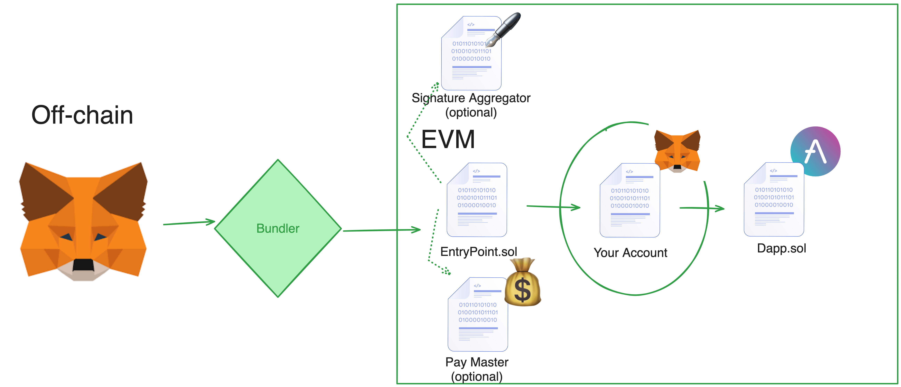

# cyfrin-advanced-foundry-account-abstraction

This project is a section of the [Cyfrin Foundry Solidity Course](https://github.com/Cyfrin/foundry-full-course-cu?tab=readme-ov-file#advanced-foundry-section-6-foundry-account-abstraction).

- [EIP-4337](https://eips.ethereum.org/EIPS/eip-4337)
- [EntryPoint contract](https://etherscan.deth.net/address/0x0000000071727de22e5e9d8baf0edac6f37da032)

## What is Account Abstraction?

EoAs are now smart contracts. That's all account abstraction is.

But what does that mean?

Right now, every single transaction in web3 stems from a single private key.

> account abstraction means that not only the execution of a transaction can be arbitrarily complex computation logic as specified by the EVM, but also the authorization logic.

- [Vitalik Buterin](https://ethereum-magicians.org/t/implementing-account-abstraction-as-part-of-eth1-x/4020)
- [EntryPoint Contract v0.6](https://etherscan.io/address/0x5ff137d4b0fdcd49dca30c7cf57e578a026d2789)
- [EntryPoint Contract v0.7](https://etherscan.io/address/0x0000000071727De22E5E9d8BAf0edAc6f37da032)
- [zkSync AA Transaction Flow](https://docs.zksync.io/build/developer-reference/account-abstraction.html#the-transaction-flow)

## What's this repo show?

1. A minimal EVM "Smart Wallet" using alt-mempool AA
   1. We even send a transactoin to the `EntryPoint.sol`
2. A minimal zkSync "Smart Wallet" using native AA
   1. [zkSync uses native AA, which is slightly different than ERC-4337](https://docs.zksync.io/build/developer-reference/account-abstraction.html#iaccount-interface)
   2. We *do* send our zkSync transaction to the alt-mempool

## What does this repo not show?

1. Sending your userop to the alt-mempool
   1. You can learn how to do this via the [alchemy docs](https://alchemy.com/?a=673c802981)
